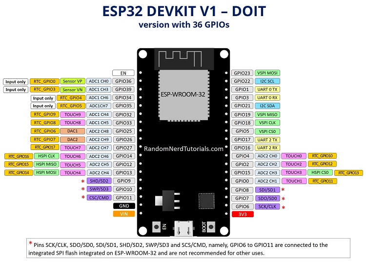
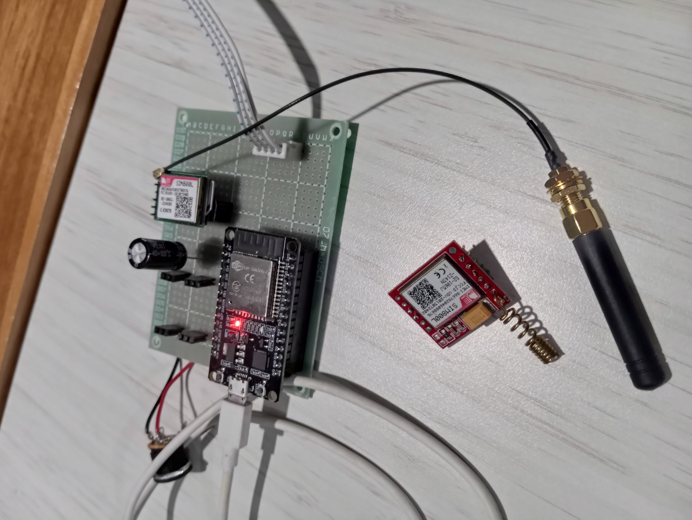

# Monitoring Ketinggian Air Sungai Belik 🌊

Sistem IoT untuk memantau ketinggian air secara real-time menggunakan **ESP32** dan **modul SIM800L**. Data dikirim ke **Firebase**, dan sistem memberikan **notifikasi otomatis ke Telegram** saat tinggi air melewati batas aman. Tampilan data ditampilkan secara visual melalui antarmuka web.

🔴 **Live Demo**:  
🌐 [https://monitoring-ketinggian-sungai-belik.vercel.app](https://monitoring-ketinggian-sungai-belik.vercel.app)

---

## 📦 Fitur

- 📏 Mengukur tinggi permukaan air menggunakan **sensor ultrasonik**
- 📡 Mengirim data ke **Firebase Realtime Database** via jaringan seluler (**tanpa Wi-Fi**)
- 📩 Mengirim **notifikasi Telegram otomatis** bila ketinggian melebihi batas tertentu
- 📊 **Tampilan web responsif** untuk melihat grafik dan status air
- 📁 Menyimpan data historis yang bisa dilihat ulang

---

## 🛠️ Komponen Hardware

| Komponen           | Fungsi                                    |
|--------------------|--------------------------------------------|
| ESP32              | Mikrokontroler utama                      |
| SIM800L            | Modul GSM/GPRS untuk koneksi internet     |
| HC-SR04            | Sensor ultrasonik pengukur jarak air      |
| Power supply 5V    | Catu daya ke ESP32 dan SIM800L            |

---

## 🗃️ Struktur Proyek

Monitoring-Ketinggian-Air/
├── arduino-code/ ← Program ESP32
├── api/ ← Bot Telegram script
├── index.html ← Website tampilan monitoring
├── Firebase_Sim800L_get/ ← Contoh ambil data dari Firebase
├── IMG_*.jpg / *.png ← Gambar dokumentasi alat
└── README.md ← Dokumentasi proyek

---

## 🚀 Instalasi dan Setup

### 1. Konfigurasi Firebase
- Buat proyek baru di [Firebase Console](https://console.firebase.google.com)
- Aktifkan **Realtime Database**
- Salin URL dan token ke dalam kode ESP32

### 2. Buat Bot Telegram
- Buka [BotFather](https://t.me/BotFather) dan buat bot
- Catat token bot (`BOT_TOKEN`)
- Gunakan API Telegram untuk mendapatkan `chat_id`

### 3. Unggah Kode ke ESP32
- Gunakan Arduino IDE
- Tambahkan board ESP32 via Boards Manager
- Install library:
  - `TinyGSM`
  - `ArduinoHttpClient`
- Edit file `arduino-code/`:
  - Masukkan `APN`, token Firebase, dan token Telegram
- Upload ke ESP32

### 4. Jalankan Web Monitoring
- Buka `index.html` di browser, atau
- Hosting via [Vercel](https://vercel.com), [Netlify](https://netlify.com), dll
- URL aktif milik kamu:  
  👉 [monitoring-ketinggian-sungai-belik.vercel.app](https://monitoring-ketinggian-sungai-belik.vercel.app)

---

## 📷 Dokumentasi

---

## ✅ Status

| Komponen       | Status  |
|----------------|---------|
| ESP32          | ✔ Aktif |
| SIM800L        | ✔ Online |
| Firebase       | ✔ Terhubung |
| Telegram Bot   | ✔ Kirim notifikasi |
| Website        | ✔ Live |

---

## 📄 Lisensi

Proyek ini menggunakan lisensi **MIT** – silakan gunakan dan modifikasi sesuai kebutuhan.

---

## ✨ Kontribusi

Pull request dan kolaborasi sangat terbuka. Silakan fork proyek ini, buat perbaikan, dan kirim PR!

---

## 🙋‍♂️ Kontak

**Krisna Aditya Pratama**  
📧 krisnaadityapratamaaa@gmail.com  
🔗 [GitHub](https://github.com/Krisnaadityapratama)
